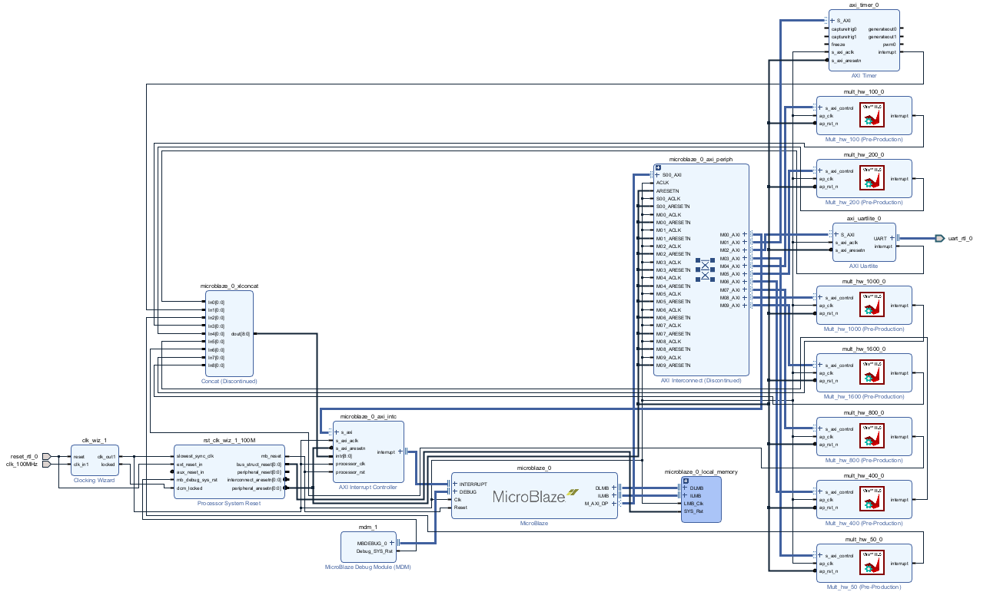

<a id="topo"></a>

# Acelerador de Vetores em FPGA — Reprodutibilidade e Fluxo



Navegação rápida: [Estrutura](#estrutura) | [Requisitos](#requisitos) | [Como clonar](#clonar) | [Fluxo resumido](#fluxo) | [Observações](#observacoes)

## Estrutura do repositório <a id="estrutura"></a>
- `Hardware/`: projeto Vivado (`soma_arrays_50_1600.xpr`), BD e constraints. Veja `Hardware/README.md`.
- `hls/` (submódulo): projetos Vitis HLS para gerar IPs de aceleração. Veja `hls/README.md`.
- `Software/`: plataformas (`.xsa`) e aplicações MicroBlaze. Veja `Software/README.md`.

Observação: a arquitetura foi implementada com diferentes IPs HLS para tamanhos de vetores de 50×50, dobrando até 1600×1600, e uma IP adicional de 1000×1000.

[Voltar ao topo](#topo)

## Target e ferramentas usadas
- Vivado: 2025.1 (detectado a partir do `.xpr`)
- Vitis/Vitis HLS: 2025.1 e/ou 2024.2 (conforme projetos em `hls/`; adaptável)
- Dispositivo: Xilinx Spartan-7 XC7S50-CSGA324-1

[Voltar ao topo](#topo)

## Requisitos <a id="requisitos"></a>
- Windows 10/11 64-bit
- Git com suporte a submódulos
- Xilinx Vivado e Vitis instalados (versões em “Target e ferramentas usadas”)
- Licenças Xilinx ativas
- Drivers JTAG e USB-UART
- Placa FPGA compatível com o dispositivo alvo (Spartan-7 XC7S50-CSGA324)

[Voltar ao topo](#topo)

## Como clonar <a id="clonar"></a>
Este repositório usa um submódulo para os projetos de HLS (`hls/`).

- Repositório principal: https://github.com/thallesmcs/fpga-vector-accelerator-mp.git
- Submódulo HLS: https://github.com/thallesmcs/Vitis_HLS.git

Clone já incluindo os submódulos (PowerShell):

```
git clone --recurse-submodules https://github.com/thallesmcs/fpga-vector-accelerator-mp.git
```

Se você já clonou sem submódulos:

```
cd fpga-vector-accelerator-mp; git submodule update --init --recursive
```

Opcional para atualizar o ponteiro do submódulo para o último commit remoto (use com cautela):

```
git submodule update --remote --merge
```

Nota: baixar como ZIP não traz submódulos.

[Voltar ao topo](#topo)

## Fluxo resumido <a id="fluxo"></a>
Pré-requisito: confira “Requisitos” e siga “Como clonar”.

- Hardware (Vivado)
	- Abra `Hardware/soma_arrays_50_1600.xpr`.
	- Rode Synthesis/Implementation e gere o bitstream.
	- Exporte o hardware com bitstream (XSA) para `Software/platforms/`.
- Software (Vitis)
	- Crie uma plataforma a partir do `.xsa` exportado em `Software/platforms/`.
	- Importe/abra a aplicação em `Software/soma_arrays_50_1600_app/`.
	- Compile e execute, acompanhando logs via UART.
- HLS (opcional)
	- Utilize os projetos em `hls/` para gerar/atualizar IPs; reintegre no Vivado se necessário.

[Voltar ao topo](#topo)

## Observações importantes <a id="observacoes"></a>
- `hls/` é um submódulo: edite no repositório do submódulo e atualize o ponteiro aqui.
- O caminho/nome do `.xsa` em `Software/platforms/` pode variar conforme a exportação.
 - Imagem de arquitetura: usando `docs/images/arq_viv.png`.

[Voltar ao topo](#topo)